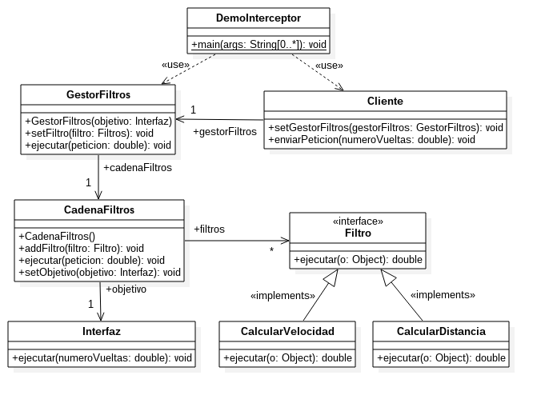

# Práctica 1: Programación de componentes con el marco de trabajo JSF

## Enunciado

Utilizando el patrón arquitectónico "Interceptor", desarrollar un diagrama de clases y programar un proyecto en Java y utilizando el marco de trabajo JSF para el tratamiento de eventos asíncronos.

El objetivo de la aplicación  es  calcular la velocidad inicial a partir de un dato de entrada que se captura con un formulario y, posteriormente, instalar un manejador de eventos que reaccione cuando se pulsen cualquiera de los 2 botones:  "Encender" y "Acelerar".

Para que el ejercicio sea considerado correcto hay que realizarlo de acuerdo con los siguientes requisitos:

Inicialmente la etiqueta del panel principal mostrará el texto "APAGADO" y  las etiquetas de los botones, el nombre de cada uno (ver figura-izqda)

El botón "Encender" será de selección de tipo conmutador cambiando de color y de texto ("Encender"/"Apagar") cuando se pulsa

La pulsación del botón de acelerar cambia el texto de la etiqueta del panel principal a "ACELERANDO" (ver figura-dcha), pero sólo si el motor está encendido; si no, no hace caso a la pulsación del usuario.

Si  se pulsa el botón que muestra ahora la etiqueta "Apagar", la etiqueta del panel principal volverá a mostrar el texto inicial "APAGADO".

Utilizar el siguiente ejemplo de demostración  para abrir una página Web dentro de un código en Java, después de arrancar el navegador por defecto.

### Patrón Interceptor

