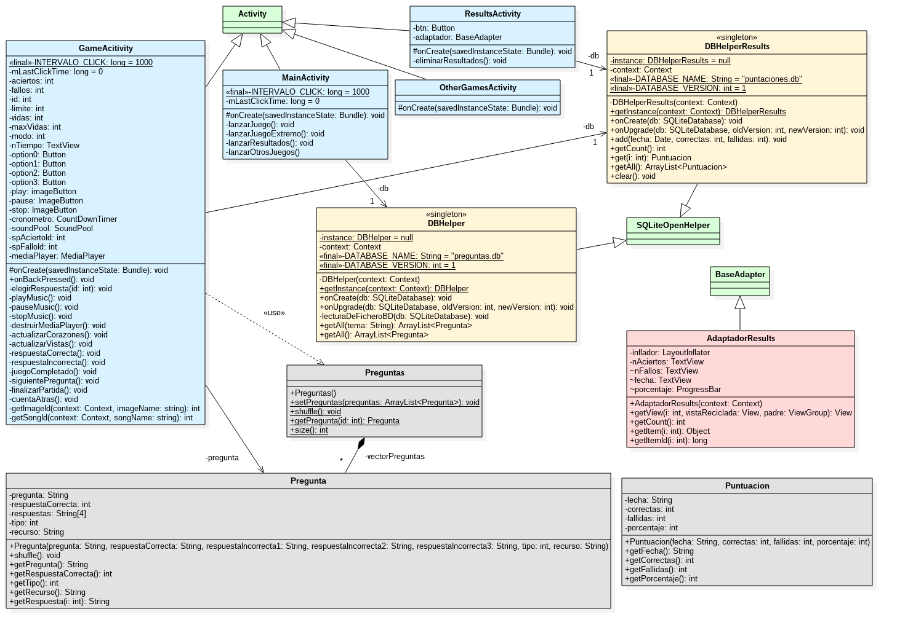

# Práctica 5: Aplicación

## Enunciado

Desarrollo completo de una aplicación interactiva para dispositivos móviles:

* El juego que se tiene que desarrollar ha de poder ejecutarse en un dispositivo Android (versión >= 4.4) o IOS (elegir sólo uno) y se trata de presentar una serie de preguntas al usuario, que tendrá que responder para alcanzar una puntuación global, así como el número de respuestas acertadas y falladas.
* Se tendrá una primera pantalla de presentación con un botón para iniciar el juego, otro para obtener los resultados y estadísticas obtenidos después de jugar y un tercer botón para enlazar con juegos similares libres que existan en Internet y que se puedan utilizar desde un tipo de aplicación como la que se pretende desarrollar.
* Cada pantalla del juego ha de consistir en 1 pregunta con 4 posibles respuestas alternativas; la pregunta podría ser un texto plano, o una pregunta que contenga imágenes y sonidos.
* Se ha de construir una base de datos de preguntas de texto planas a la que acceda directamente la app, de tal forma que en el futuro se puedan cambiar las preguntas de texto sin tener que modificar el código de la citada aplicación, aunque haya que volver a generar el archivo apk desplegable.
* Al seleccionar una de las respuestas en cada pregunta ha de aparecer un mensaje de felicitación en el pie de la pantalla junto con un sonido de acierto o fallo; después de unos segundos se pasará a la siguiente pantalla con otra pregunta.
* En caso de no acertar, se ha de poder elegir entre volver a la pantalla inicial para comenzar de nuevo el juego y se obtendrá un mensaje con la respuesta correcta o bien continuar el juego (no se obtendría las soluciones hasta el final); en ambos casos, se pueden obtener los resultados acumulados durante el desarrollo de un juego volviendo a la pantalla de inicio y pulsando e el botón "Resultados".
* Tras la última pregunta, el mensaje que se mostrará será de felicitación por haber realizado el juego y mensaje de despedida antes de volver a iniciar el juego.

Para que la aplicación desarrollada sea evaluada favorablemente ha de satisfacer los siguientes requisitos:

Funcionales:

1. El juego deberá mostrar una batería de preguntas.
2. El usuario ha de poder responder a las preguntas de una en una
3. Si el usuario falla la pregunta, se le mostrará un mensaje indicándole que ha fallado junto con un sonido
4. Si el usuario acierta,se le muestra un mensaje indicándole que ha acertado.
5. Ha de haber pantallas de pregunta que incluyan 1 imagen
6. Si el usuario falla, entonces deberá aparecer la opción de continuar la partida o de volver a iniciar el juego.
7. si el usuario acierta, continuará con la siguiente pregunta.
8. Cuando el usuario finaliza la partida, se le muestran los resultados que ha obtenido.
9. El menú deberá poder dirigirnos, al inicio de una nueva partida, a una opción que nos permita ver los resultados obtenidos en las partidas realizadas anteriormente, o a otros juegos en la Red mediante un webView.

No funcionales:

1. Solamente puede hacerse un único acceso a la base de datos.
2. La aplicación deberá funcionar como mínimo en dispositivos con versiones de sistemas operativos actuales (por ejemplo: Android >=4.4)
3. La aplicación debe funcionar tanto en dispositivos móviles (teléfonos) como en tablets.
4. Se debe desarrollar la aplicación pedida aplicando Patrones de Diseño Software (por ejemplo: Singleton, Inmutable, Proxy, Escuchador de Eventos) y Patrones Arquitectónicos (por ejemplo: MVC, DataBaseManagement System).

## Software Utilizado

* Ubuntu 16.04
* Android Studio 2.2.3
* Genymotion 2.8.1

## Arquitectura y diseño

### Modelo Vista Controlador (MVC)

La aplicación sigue una arquitectura clásica MVC:

* Modelo: Bases de datos, imágenes y sonidos
* Vista: Layouts
* Controlador: A su vez se divide en tres partes:
  * Middleware con las bases de datos: DBHelpers
  * Middleware con las vistas: Actividades
  * Modelo interno

### Diagrama de clases

Se han coloreado las distintas clases de diferentes colores:

* Verde: Clases definidas por Android de las que se heredan (actividades, base de datos y adaptador)
* Azul: Actividades
* Naranja: DBHelpers
* Rojo: Adaptador
* Gris: Modelo interno

## El juego

### Temática

Se ha desarrollado un juego Quiz con preguntas sobre Disney.

### Preguntas

Hay un total de 100 preguntas que pueden ser de tres tipos:

* Normal: Pregunta de texto
* De imagen: Pregunta sobre una imagen
* De sonido: Pregunta sobre un sonido

Hay 57 preguntas de texto, 33 de imágenes y 10 de sonido.

### Modos de juego

Se presentan dos modos de juego:

* Arcade: Se elige un número de preguntas a resolver y se van resolviendo hasta alcanzar este número.
* Extremo: Se tienen cinco vidas y se van resolviendo todas las que hay en la base de datos hasta que se pierden las cinco vidas.

En ambos modos se puede salir en cualquier momento.

Los resultados obtenidos se almacenan en una base de datos para poder ser consultados con posterioridad.

## Instalación

Se puede instalar usando el archivo `app-release.apk` (para ello tiene que estar habilitada la configuración de permitir instalar aplicaciones de orígines desconocidos en el smartphone).

## Generación de `.apk`

Para generar el *keystore* (`.jks`) se ha seguido el siguiente [tutorial](http://developer.android.com/studio/publish/app-signing.html?hl=es-419#release-mode). Con este *keystore* se puede generar el `.apk` siguiendo [estas instrucciones](http://developer.android.com/studio/publish/app-signing.html?hl=es-419#sign-auto). No se ha subido el *keystore* generado por los problemas de seguridad consecuentes.

## Tests realizados

Se ha probado la aplicación tanto en *smartphones* como *tablets* usando el software Genymotion para su creación virtual dentro de un ordenador.

Asímismo se ha probado en un dispositivo real (Motorola Moto G2) verificando su correcto funcionamiento.
