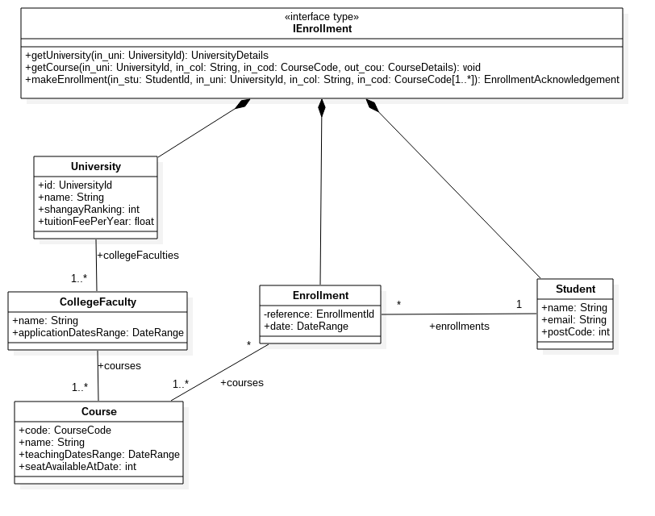

# DSS - Ejercicio especificación de interfaz en UML y OCL

> Francisco Javier Bolívar Lupiáñez

### I. Ejercicio de especificación de interfaz de un sistema de matriculación en una universdidad



### II. Ejercicio de especificación utilizando OCL de la operación `getStudentDetails(...)`

```
context: IStudentManagement::getStudentDetails(in stu: StudentIdentifier): StudentDetails
pre:
  -- 'stu' es un identificador valido de estudiante
  student->exists(s | s.id = stu)
post:
  -- los detalles devueltos tras la ejecucion coinciden con los del estudiante
  -- cuyo identificador es 'stu'
  Let elEstudiante = student->select(s | s.id = stu) in
    -- especificar el resultado
    result.name = stu.name
    result.email = stu.email
    result.postCode = stu.postCode
```
