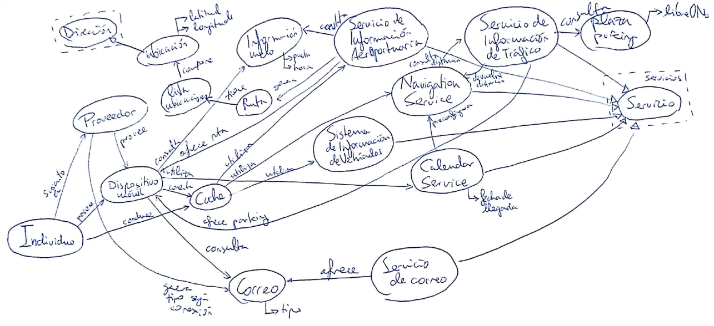

# DSS - Ontología

> Francisco Javier Bolívar Lupiáñez

**Elaborar un diagrama ontológico que describa la información semántica de contexto de un usuario de un sistema ubicuo, necesaria para correcta composición de servicios que se le ofrecen en el caso de referencia siguiente. El usuario de los servicios llega a las afueras de la ciudad porque quiere ir a recoger a alguien el aeropuerto. Su coche le ofrece la posibilidad de utilizar el servicio NavigationService (NS) que ya está pre-configurado con los datos recibidos desde el CalendarService(CS) del móvil del usuario que contiene una entrada con la fecha de llegada del viajero. Conforme va conduciendo el usuario prefiere que las indicaciones para llegar al aeropuerto se le ofrezcan en el sistema de información de vehículos (IVIS), de manera que puede utilizar el mencionado NS que interacciona con el Servicio de Información de Tráfico (SIT) para poder calcular la distancia más corta al aeropuerto. Cuando se aproxima al área del aeropuerto, su sistema IVIS descubre un nuevo servicio, el denominado Servicio de Información Aeroportuaria (SIA), que le informa, entre otras cosas, del número de puerta y de la hora de llegada del vuelo. Su NS automáticamente utiliza el nuevo servicio que acaba de descubrir y calcula una nueva ruta a la puerta de desembarco mientras que el SIT le proporciona información acerca de las plazas de aparcamiento disponibles cerca de la puerta aludida. El usuario aparca su coche y llega a la puerta justo a tiempo para recoger al viajero. Mientras tanto, cuando quiere consultar su e-mail, el usuario descubre que sólo tiene la cabecera de los mensajes y un símbolo que indica que el proceso de recepción del correo no ha terminado y que continuará más tarde, cuando se disponga de mayor ancho de banda en la red del proveedor. No conoce los tipos de servicios que pueden tener disponibles, ya que los proveedores de servicios en este caso actúan recomendando un servicio dependiendo del contexto actual del usuario; por tanto, debido al cambio en la oferta de servicios, cuando éste se aproxima a la zona del aeropuerto, la composición actual de servicios que usa en su móvil se ve modificada con la disponibilidad del SIA. Por último, el servicio de correo le ofrece la posibilidad de elegir entre 5 opciones de acceso a su e-mail: headMail, fullMail, EncryptedMail, BigMail y EncryptedBigMail, a partir de una evaluación de la situación del contexto en ese momento.**

